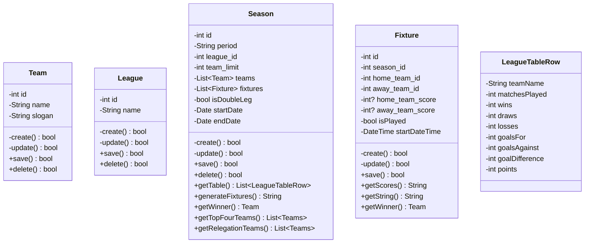
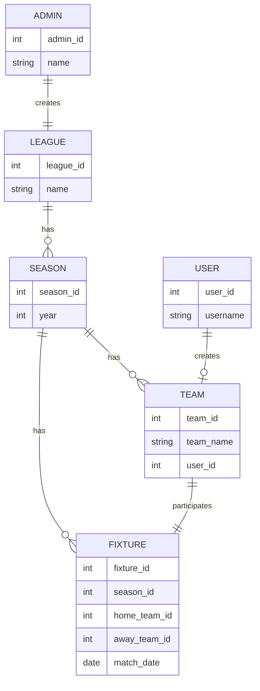

# Fantasy League
This is an API for a fantasy league

# Class Diagram

```mermaid
classDiagram

class Team{
-int id
-String name
-String slogan
-create() bool
-update() bool
+save() bool
+delete() bool
}

class League{
-int id
-String name
-create() bool
-update() bool
+save() bool
+delete() bool
}

class Season{
-int id
-String period
-int league_id
-int team_limit
-List~Team~ teams
-List~Fixture~ fixtures
-bool isDoubleLeg
-Date startDate
-Date endDate
-create() bool
-update() bool
+save() bool
+delete() bool
+getTable() List~LeagueTableRow~
+generateFixtures() String
+getWinner() Team
+getTopFourTeams() List~Teams~
+getRelegationTeams() List~Teams~
}

class Fixture{
-int id
-int season_id
-int home_team_id
-int away_team_id
-int? home_team_score
-int? away_team_score
-bool isPlayed
-DateTime startDateTime
-create() bool
-update() bool
+save() bool
+getScores() String
+getString() String
+getWinner() Team
}

class LeagueTableRow{
-String teamName
-int matchesPlayed
-int wins
-int draws
-int losses
-int goalsFor
-int goalsAgainst
-int goalDifference
-int points
}
```

```mermaid
erDiagram
    ADMIN ||--|| LEAGUE : creates
    LEAGUE ||--o{ SEASON : has
    SEASON ||--o{ TEAM : has
    SEASON ||--o{ FIXTURE : has
    USER ||--o| TEAM : creates
    TEAM ||--|| FIXTURE : participates
   

    ADMIN{
        int admin_id
        string name
    }
    
    LEAGUE {
        int league_id
        string name
    }

    SEASON {
        int season_id
        int year
    }

    TEAM {
        int team_id
        string team_name
        int user_id
    }

    FIXTURE {
        int fixture_id
        int season_id
        int home_team_id
        int away_team_id
        date match_date
    }

    USER {
        int user_id
        string username
    }
```
