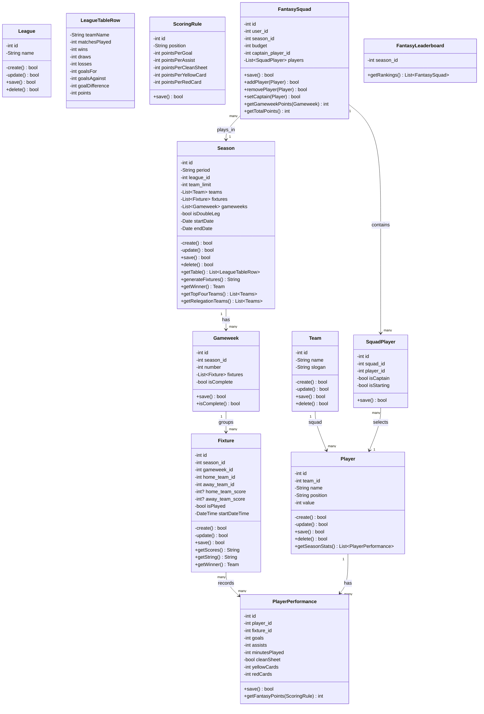
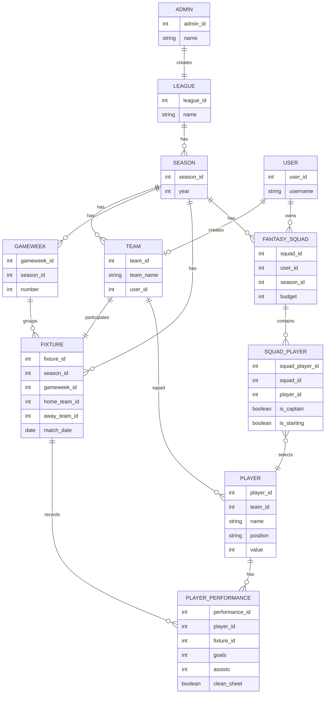

# Fantasy League
This is an API for a fantasy league. Admins run club leagues, seasons, and fixtures; users draft simulated players onto a fantasy squad and score points based on those players' simulated match performances.

# Class Diagram

