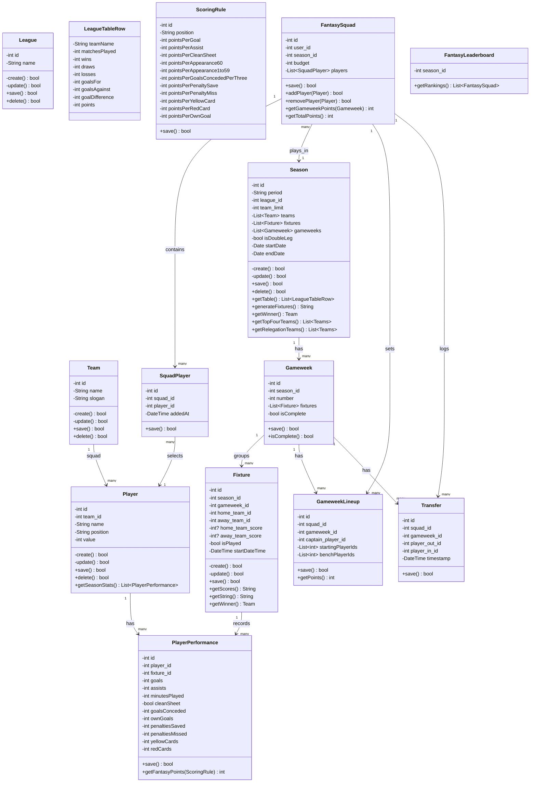
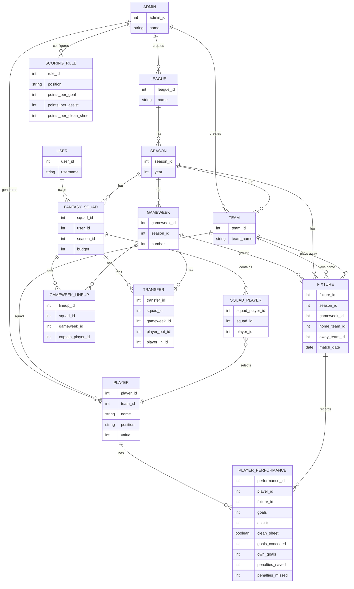

# Fantasy League
This is an API for a fantasy league. Admins run club leagues, seasons, and fixtures; users draft simulated players onto a fantasy squad and score points based on those players' simulated match performances.

# Class Diagram

# Scoring Rules

Default fantasy points, weighted by position. Bench players never score; a starting player who doesn't feature scores 0 (no auto-substitutions in v1).

| Stat | GK | DEF | MID | FWD |
|---|---|---|---|---|
| Goal | 10 | 6 | 5 | 4 |
| Assist | 3 | 3 | 3 | 3 |
| Clean sheet | 4 | 4 | 1 | 0 |
| Played 60+ min | 2 | 2 | 2 | 2 |
| Played 1-59 min | 1 | 1 | 1 | 1 |
| Every 3 goals conceded | -1 | -1 | - | - |
| Penalty save | 5 | - | - | - |
| Penalty miss | -2 | -2 | -2 | -2 |
| Yellow card | -1 | -1 | -1 | -1 |
| Red card | -3 | -3 | -3 | -3 |
| Own goal | -2 | -2 | -2 | -2 |

The captain's total points for the gameweek are doubled.

# Squad Rules

Each fantasy squad has 15 players: 2 goalkeepers, 5 defenders, 5 midfielders, 3 forwards, all within a shared budget. For each gameweek's GameweekLineup, the starting XI is chosen from that squad in a valid formation: exactly 1 GK, 3-5 DEF, 2-5 MID, 1-3 FWD, totaling 11 starters (the remaining 4 are bench and never score, per the Scoring Rules above). One starter is designated captain on the GameweekLineup and their points are doubled for that gameweek.
