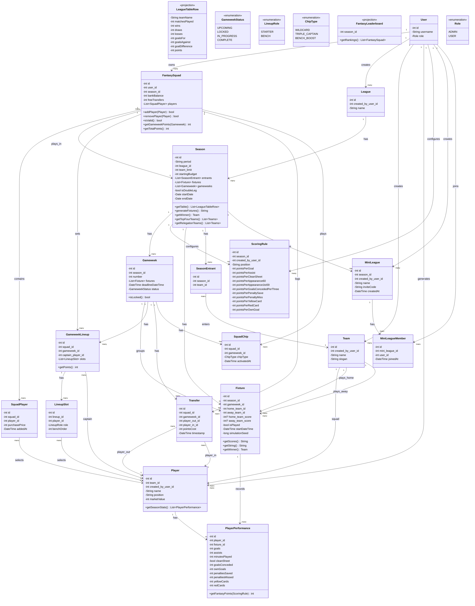
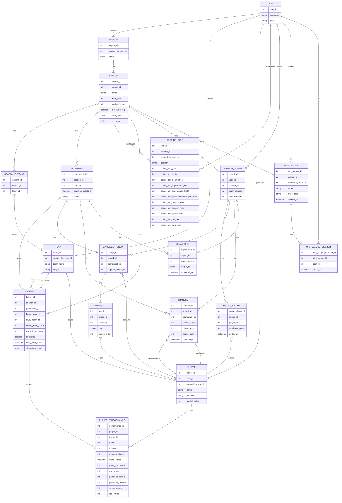

# Fantasy League
This is an API for a fantasy league. Admins run club leagues, seasons, and fixtures; users draft simulated players onto a fantasy squad and score points based on those players' simulated match performances.

> Note: `League` here means the underlying football competition (admin-managed). Private user-vs-user mini-leagues are a separate entity, `MiniLeague`, to avoid colliding with this one.

Significant architecture decisions (persistence pattern, stack, simulation determinism, auth, etc.) are recorded in [docs/adr](docs/adr/README.md).

## Contents
- [Getting Started](#getting-started)
- [API Overview](#api-overview)
- [Testing](#testing)
- [Class Diagram](#class-diagram)
- [Scoring Rules](#scoring-rules)
- [Squad Rules](#squad-rules)
- [Gameweek Lifecycle](#gameweek-lifecycle)
- [Match Simulation](#match-simulation)

# Getting Started

**Stack:** Java 21, Spring Boot 3.4.2, Spring Security (JWT), Spring Data JPA, Postgres, Flyway, springdoc-openapi. See [docs/adr](docs/adr/README.md) for the reasoning behind each choice.

**Prerequisites:** a JDK 21, Docker (for Postgres — there's no H2/in-memory fallback outside the test profile, per [ADR 0003](docs/adr/0003-postgres-and-flyway.md)). The Maven wrapper (`mvnw`/`mvnw.cmd`) is checked in, so a local Maven install isn't required.

1. Start Postgres:
   ```
   docker run --name fantasy-league-db -e POSTGRES_USER=fantasy_league -e POSTGRES_PASSWORD=fantasy_league -e POSTGRES_DB=fantasy_league -p 5432:5432 -d postgres
   ```
2. Run the app (Flyway applies migrations automatically on startup):
   ```
   ./mvnw spring-boot:run
   ```
   The API listens on `http://localhost:8080`.

Config is environment-variable driven (`SPRING_DATASOURCE_URL`/`_USERNAME`/`_PASSWORD`, `JWT_SIGNING_SECRET`) with the values above as local defaults — see `src/main/resources/application.properties`. Never commit real secrets; override `JWT_SIGNING_SECRET` for anything beyond local development.

# API Overview

Interactive docs are served by the running app, no separate setup needed:
- Swagger UI: `http://localhost:8080/swagger-ui/index.html`
- Raw OpenAPI JSON: `http://localhost:8080/v3/api-docs`

Every operation documents not just its success response but every error it can actually return (400/401/403/404/409/500), derived from the shape of the endpoint — see `OpenApiConfig`. All error bodies follow the RFC 7807 `ProblemDetail` shape ([ADR 0009](docs/adr/0009-rest-api-conventions.md)).

Resources are nested under the entities that own them:
- `POST /api/v1/auth/{register,login,refresh,logout}` — JWT access + refresh tokens ([ADR 0008](docs/adr/0008-jwt-authentication.md))
- `/api/v1/leagues`, `/api/v1/teams`, `/api/v1/players` — top-level, admin-managed
- `/api/v1/leagues/{leagueId}/seasons` — and nested under a season: `fixtures`, `scoring-rules`, `gameweeks`, `standings`, `squad`, `leaderboard`
- `/api/v1/leagues/{leagueId}/seasons/{seasonId}/gameweeks/{gameweekId}/lineup`, `.../points` — per-gameweek lineup submission and scoring

Requests need `Authorization: Bearer <access token>` except the `auth` endpoints above; `ADMIN`-only operations are marked as such in Swagger UI.

# Testing

```
./mvnw test
```
Runs the full suite: unit tests (pure domain logic), service tests (Mockito-mocked repositories), `@DataJpaTest` repository tests against H2, and `@WebMvcTest` controller tests — no Docker needed. [ADR 0011](docs/adr/0011-testing-strategy.md) also specifies a Testcontainers-backed `*IT.java` layer run via `./mvnw verify`; that layer isn't wired up in the build yet.

# Class Diagram

Persistence methods (`save()`/`create()`/`update()`/`delete()`) are omitted below — they're implied for every entity. Only behavioral methods are shown.


`ADMIN` and `USER` are merged into a single `USER` entity with a `role`, since both are just accounts distinguished by permissions.



**Constraints not expressible in the diagram:** `PLAYER_PERFORMANCE` is unique on `(player_id, fixture_id)`; `SCORING_RULE` is unique on `(season_id, position)`; `SEASON_ENTRANT` is unique on `(season_id, team_id)`; `SQUAD_CHIP` is unique on both `(squad_id, gameweek_id)` (one chip active per gameweek) and `(squad_id, chip_type)` (each chip usable once per season); `MINI_LEAGUE` is unique on `invite_code`; `MINI_LEAGUE_MEMBER` is unique on `(mini_league_id, user_id)`.

# Scoring Rules

Scoring rules are configured per season (one `ScoringRule` row per position, per season), so changing them never rewrites points for gameweeks that already happened. The table below is the default set a new season is seeded with. A starting player who records 0 minutes is auto-substituted by the first bench player, in bench order, who did play and whose replacement keeps the starting formation legal (reserve keeper only ever covers the starting keeper); a player left on the bench with no valid substitution never scores. There's no vice-captain -- if the captain is the one subbed out, the doubled armband is simply lost for that gameweek.

| Stat | GK | DEF | MID | FWD |
|---|---|---|---|---|
| Goal | 10 | 6 | 5 | 4 |
| Assist | 3 | 3 | 3 | 3 |
| Clean sheet | 4 | 4 | 1 | 0 |
| Played 60+ min | 2 | 2 | 2 | 2 |
| Played 1-59 min | 1 | 1 | 1 | 1 |
| Every 3 goals conceded | -1 | -1 | - | - |
| Penalty save | 5 | - | - | - |
| Penalty miss | -2 | -2 | -2 | -2 |
| Yellow card | -1 | -1 | -1 | -1 |
| Red card | -3 | -3 | -3 | -3 |
| Own goal | -2 | -2 | -2 | -2 |

The captain's total points for the gameweek are doubled.


# Squad Rules

Each fantasy squad has 15 players: 2 goalkeepers, 5 defenders, 5 midfielders, 3 forwards, all within the season's starting budget, with a maximum of 3 players from any one real team. Each `SquadPlayer` records the price paid (`purchasePrice`) so a squad's value stays accurate even if player prices change in a future version; a squad's remaining funds are tracked as `bankBalance`.

For each gameweek's `GameweekLineup`, the starting XI is chosen from that squad in a valid formation via `LineupSlot` rows: exactly 1 GK, 3-5 DEF, 2-5 MID, 1-3 FWD, totaling 11 starters (the remaining 4 are bench and never score, per the Scoring Rules above). One starter is designated captain on the `GameweekLineup` and their points are doubled for that gameweek.

Transfers between gameweeks swap a `SquadPlayer` in exchange for another within the remaining budget. Each squad gets 1 free transfer per gameweek (accruing up to a maximum of 2 banked), and each additional transfer beyond the free allowance costs 4 points, recorded as `pointsCost` on the `Transfer`.

## Chips

Each squad may play `WILDCARD`, `TRIPLE_CAPTAIN`, and `BENCH_BOOST` at most once each per season, and only one chip can be active in any single gameweek (both enforced by unique constraints on `SquadChip`, not just app-level checks). Activating a chip is immediate and final -- there's no un-playing it once submitted, same as a transfer.

- **WILDCARD** -- that gameweek's transfers are free and don't touch the banked free-transfer count, however many are made.
- **TRIPLE_CAPTAIN** -- the captain's points are tripled instead of doubled for that gameweek.
- **BENCH_BOOST** -- bench players' points count toward the gameweek total instead of scoring 0; auto-substitution doesn't run that week since everyone already counts.

There's no vice-captain concept: if the captain happens to be auto-substituted out, the doubled (or tripled) armband is simply lost for that gameweek rather than passed to anyone else.

## Mini-Leagues

A `MiniLeague` is a private, season-scoped leaderboard restricted to a subset of squads -- the same ranking as the season-wide leaderboard, just filtered to members. Creating one requires already having a fantasy squad for that season; the creator is auto-joined as its first member. Sharing the returned `inviteCode` is the only way in -- there's no browse/discover, and a non-member gets a 404 (not 403) when trying to view a mini-league's leaderboard, so its existence isn't visible to outsiders either.

# Gameweek Lifecycle

Each `Gameweek` has a `deadlineDateTime` and moves through `UPCOMING` → `LOCKED` → `IN_PROGRESS` → `COMPLETE`. Squad selection, lineup changes, and transfers are only permitted while a gameweek is `UPCOMING`; once its deadline passes it locks, preventing changes based on information from matches already in progress. Points become official when the gameweek reaches `COMPLETE`.

# Match Simulation

Player performances are generated, not real: each `Fixture` is simulated from team/player ratings using a Poisson-distributed goal count per side, with a seeded, deterministic random generator. The `simulationSeed` stored on `Fixture` means a simulation can be re-run to produce an identical result, which keeps the engine testable (fixed-seed golden tests) and debuggable (no simulation is ever a one-off you can't reproduce).
