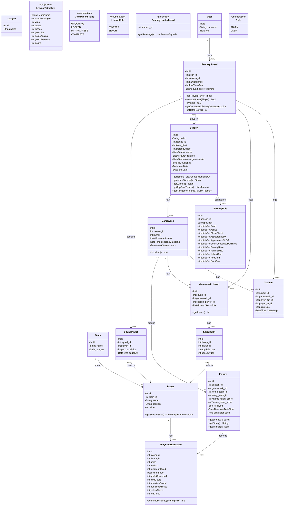
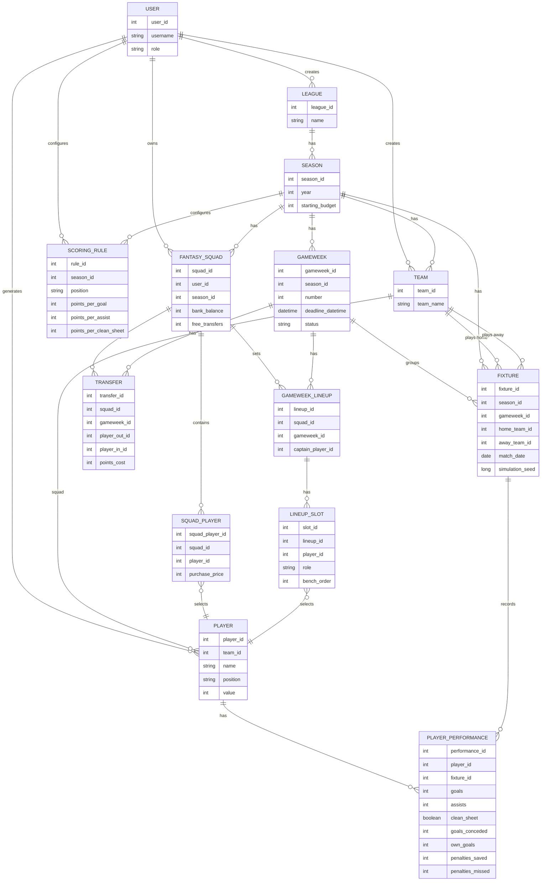

# Fantasy League
This is an API for a fantasy league. Admins run club leagues, seasons, and fixtures; users draft simulated players onto a fantasy squad and score points based on those players' simulated match performances.

> Note: `League` here means the underlying football competition (admin-managed). Private user-vs-user mini-leagues are a planned feature and will need a distinct name (e.g. `MiniLeague`) to avoid colliding with this entity.

# Class Diagram

Persistence methods (`save()`/`create()`/`update()`/`delete()`) are omitted below — they're implied for every entity. Only behavioral methods are shown.

`ADMIN` and `USER` are merged into a single `USER` entity with a `role`, since both are just accounts distinguished by permissions.

**Constraints not expressible in the diagram:** `PLAYER_PERFORMANCE` is unique on `(player_id, fixture_id)`; `SCORING_RULE` is unique on `(season_id, position)`.

# Scoring Rules

Scoring rules are configured per season (one `ScoringRule` row per position, per season), so changing them never rewrites points for gameweeks that already happened. The table below is the default set a new season is seeded with. Bench players never score; a starting player who doesn't feature scores 0 (no auto-substitutions in v1).

| Stat | GK | DEF | MID | FWD |
|---|---|---|---|---|
| Goal | 10 | 6 | 5 | 4 |
| Assist | 3 | 3 | 3 | 3 |
| Clean sheet | 4 | 4 | 1 | 0 |
| Played 60+ min | 2 | 2 | 2 | 2 |
| Played 1-59 min | 1 | 1 | 1 | 1 |
| Every 3 goals conceded | -1 | -1 | - | - |
| Penalty save | 5 | - | - | - |
| Penalty miss | -2 | -2 | -2 | -2 |
| Yellow card | -1 | -1 | -1 | -1 |
| Red card | -3 | -3 | -3 | -3 |
| Own goal | -2 | -2 | -2 | -2 |

The captain's total points for the gameweek are doubled.

# Squad Rules

Each fantasy squad has 15 players: 2 goalkeepers, 5 defenders, 5 midfielders, 3 forwards, all within the season's starting budget, with a maximum of 3 players from any one real team. Each `SquadPlayer` records the price paid (`purchasePrice`) so a squad's value stays accurate even if player prices change in a future version; a squad's remaining funds are tracked as `bankBalance`.

For each gameweek's `GameweekLineup`, the starting XI is chosen from that squad in a valid formation via `LineupSlot` rows: exactly 1 GK, 3-5 DEF, 2-5 MID, 1-3 FWD, totaling 11 starters (the remaining 4 are bench and never score, per the Scoring Rules above). One starter is designated captain on the `GameweekLineup` and their points are doubled for that gameweek.

Transfers between gameweeks swap a `SquadPlayer` in exchange for another within the remaining budget. Each squad gets 1 free transfer per gameweek (accruing up to a maximum of 2 banked), and each additional transfer beyond the free allowance costs 4 points, recorded as `pointsCost` on the `Transfer`.

# Gameweek Lifecycle

Each `Gameweek` has a `deadlineDateTime` and moves through `UPCOMING` → `LOCKED` → `IN_PROGRESS` → `COMPLETE`. Squad selection, lineup changes, and transfers are only permitted while a gameweek is `UPCOMING`; once its deadline passes it locks, preventing changes based on information from matches already in progress. Points become official when the gameweek reaches `COMPLETE`.

# Match Simulation

Player performances are generated, not real: each `Fixture` is simulated from team/player ratings using a Poisson-distributed goal count per side, with a seeded, deterministic random generator. The `simulationSeed` stored on `Fixture` means a simulation can be re-run to produce an identical result, which keeps the engine testable (fixed-seed golden tests) and debuggable (no simulation is ever a one-off you can't reproduce).
